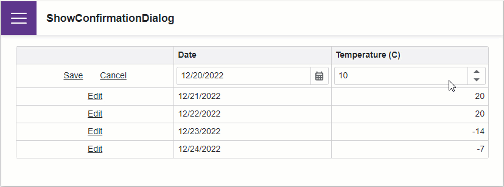

<!-- default badges list -->

<!-- default badges end -->
# Grid for Blazor - How to display a confirmation dialog when users start editing another row without saving changes

This example illustrates how to show a confirmation dialog when users start editing another row in the [DevExpress Blazor Grid](https://docs.devexpress.com/Blazor/403143/grid) without saving the changes they made. This dialog allows users to save or discard the pending changes.

## Overview

The Grid discards all unsaved changes if a user starts editing a grid row while another row is being edited. In such a scenario, you can show a [pop-up window](https://docs.devexpress.com/Blazor/DevExpress.Blazor.DxPopup) and prompt users to save or discard their changes. Follow the steps below to implement this behavior:

1. Configure the Grid component to allow users to edit grid data. Refer to the following help topic for more information: [Edit Data and Validate Input](https://docs.devexpress.com/Blazor/403454/grid/edit-data-and-validate-input).

2. Add the [Popup](https://docs.devexpress.com/Blazor/DevExpress.Blazor.DxPopup) component that includes the custom **Save** and **Cancel** buttons. In response to a click on the **Cancel** button, set the DxPopup's [Visible](https://docs.devexpress.com/Blazor/DevExpress.Blazor.DxPopupBase.Visible) property to `false` to close the pop-up window. When a user clicks **Save**, call the DxGrid's [SaveChangesAsync](https://docs.devexpress.com/Blazor/DevExpress.Blazor.DxGrid.SaveChangesAsync) method to save the changes and close the pop-up window.

3. Use the command column's [CellDisplayTemplate](https://docs.devexpress.com/Blazor/DevExpress.Blazor.DxGridCommandColumn.CellDisplayTemplate) property to replace the built-in **Edit** button with a custom button. When a user clicks the custom button, check whether the component data [was modified](https://learn.microsoft.com/en-us/dotnet/api/microsoft.aspnetcore.components.forms.editcontext.ismodified?view=aspnetcore-7.0). Show the pop-up window if the Grid component has unsaved changes; otherwise, start editing the clicked row.  
 
4. Once the pop-up window [closes](https://docs.devexpress.com/Blazor/DevExpress.Blazor.DxPopupBase.Closed), start editing the clicked row.

## Files to Review

- [Index.razor](./CS/ShowConfirmationDialog/Pages/Index.razor)

## Documentation

- [Bind the Grid to Data](https://docs.devexpress.com/Blazor/403737/grid/bind-to-data)
- [Edit Grid Data and Validate Input](https://docs.devexpress.com/Blazor/403454/grid/edit-data-and-validate-input)

## More Examples

- [Grid for Blazor - How to post changes to an in-memory data source](https://github.com/DevExpress-Examples/blazor-dxgrid-post-changes-to-data-source)
- [Grid for Blazor - Create a custom record deletion confirmation dialog](https://github.com/DevExpress-Examples/blazor-dxgrid-show-custom-confirmation-dialog)
- [Grid for Blazor – How to activate EditRow mode and define data editors for row cells](https://github.com/DevExpress-Examples/blazor-grid-row-editing)
<!-- feedback -->
## Does this example address your development requirements/objectives?

 

(you will be redirected to DevExpress.com to submit your response)
<!-- feedback end -->
